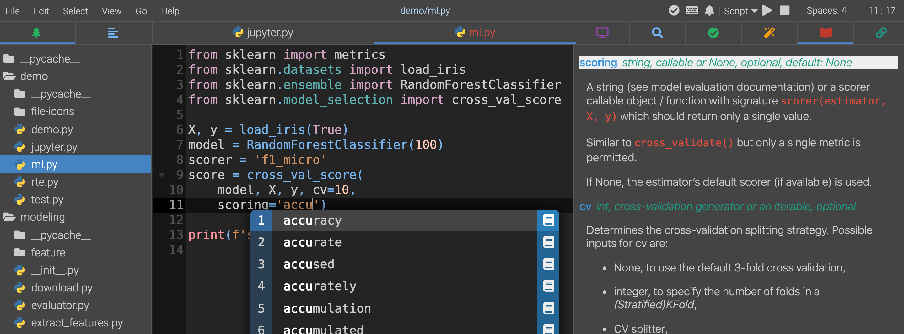

# Akimous

Akimous is a Python IDE with unique features boosting developers' productivity.

### Features

* Machine-learning-assisted/NLP-assisted context-aware auto completion
* Beautifully rendered function documentation
* Layered keyboard control (a more intuitive key binding than vim and Emacs)
* Real-time code formatter
* Interactive console (integration with IPython kernel)



For more information and documentation, visit the official website.

## Installation

### Supported Environments

* Akimous requires Python 3.7 or newer to run. The latest two major version of Python 3 will be supported.
* Latest versions of Firefox, Chrome and Safari are supported.

### Dependencies

Akimous has some dependencies (e.g. XGBoost) requiring a C/C++ compiler to build. It is recommended to have one of the following before installation:

* gcc and g++
* clang

### Install From PyPI

The recommended way for installing Akimous is through PyPI.

```sh
pip install -U akimous
```

### Using  Docker Image

If you have difficulty installing, or you are running in a cloud environment, try the prebuilt docker image.

```sh
# COMING SOON
```

## Commands

Start the app by typing in the terminal (the browser will automatically open if available): 

```sh
akimous
```

#### Options

* `--help`: show help message and exit.
* `--host HOST`: specify the host for Akimous server to listen on. (default to 0.0.0.0 if inside docker, otherwise 127.0.0.1)
* `--port PORT`: The port number for Akimous server to listen on. (default=3179)
* `--no-browser`: Do not open the IDE in a browser after startup.
* `--verbose`: Print extra debug messages.

## Development

Make sure you have recent version of the following build dependencies installed.

* Node (12+)
* Python (3.7+)
* [Poetry](https://poetry.eustace.io)
* [Yarn](https://yarnpkg.com/)
* Make
* [Zopfli](https://github.com/google/zopfli)
* [Parallel](https://www.gnu.org/software/parallel/)

Run the following commands according to your need.

```sh
make # build everything
make test # run tests
make lint # run linters
make install # (re)install the package
```

Running `make` will install all Python and Javascript dependencies listed in `pyproject.toml` and `ui/package.json` automatically.

## Contributing

This program is at pre-alpha stage. Please do report issues if you run into some problems. Contributions of any kind are welcome, including feature requests or pull requests (can be as small as correcting spelling errors) . 

## License

[BSD-3-Clause](LICENSE)